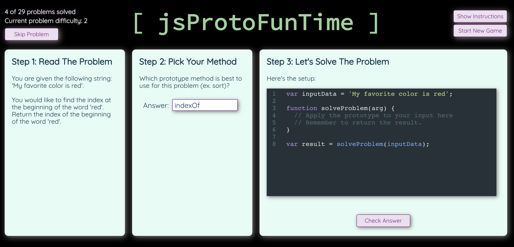
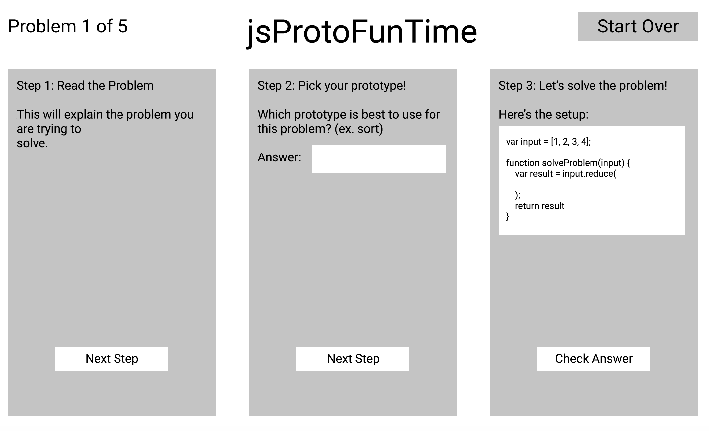

# jsProtoFunTime

### See it Live!

### Set-Up Front-End:
Clone this repo  
Run `npm install` from the root directory  
Run `npm start` and visit localhost:3000 in your browser

### Background / About:
This project focused on building a web app to help Turing School students study content they are learning in class. The focus of this project was to create a dataset of problems involving Javascript prototype methods and allow the user to solve the problems in three logical steps.
- Step 1: Read the problem.
- Step 2: Pick the prototype method to solved the problem.
- Step 3: Code out the problem and evaluate your code to check against the solution.
This project will teach students how to apply prototype methods to a problem and also help them memorize prototype methods that are useful in an Javascript based application.

### Primary Technologies Used:
 - React
 - Javascript
 - HTML
 - SASS
 - CodeMirror

### Testing:
Jest and Enzyme for front-end testing.  
Run `npm test` from the root directory

### Enhancements:
Additional enhancements we would like to include in the future
* Give user more feedback on code when their answer is correct
* Update dataset to fix errors in data and add more problems.

### Screenshots:

### Original Assignment:
[Memoize](http://frontend.turing.io/projects/memoize.html) project from Turing School of Software and Design

### Contributors:
[Karin Ohman](https://github.com/kaohman)  

### Wireframe:
  
